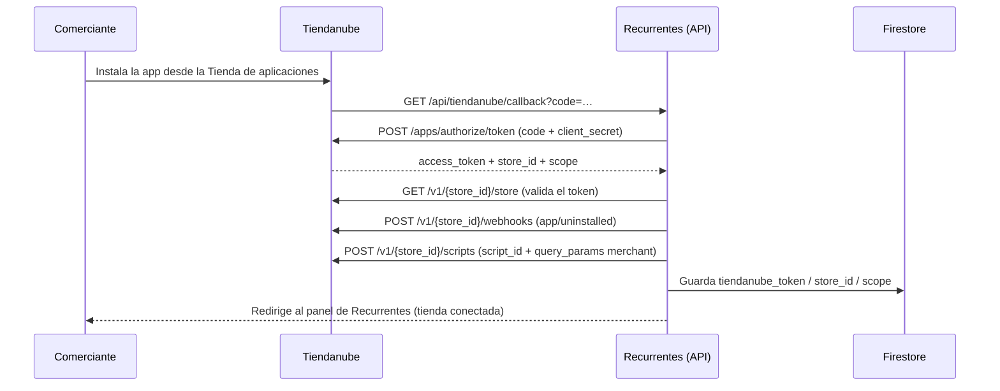
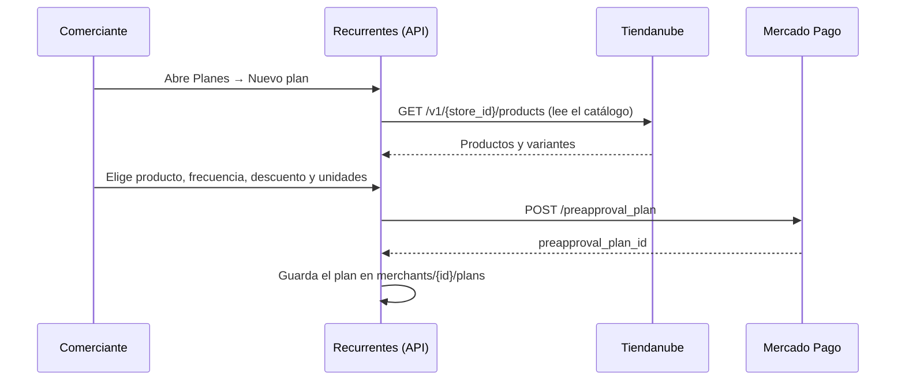
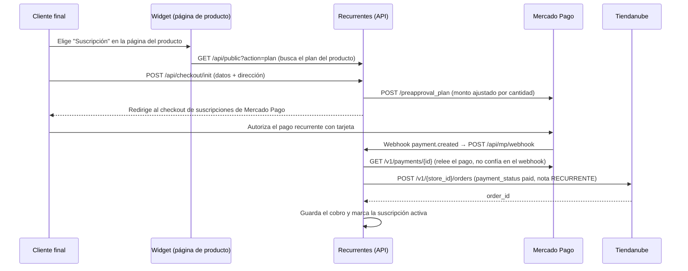
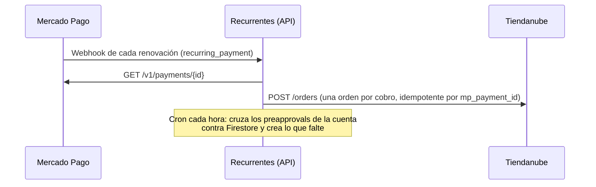
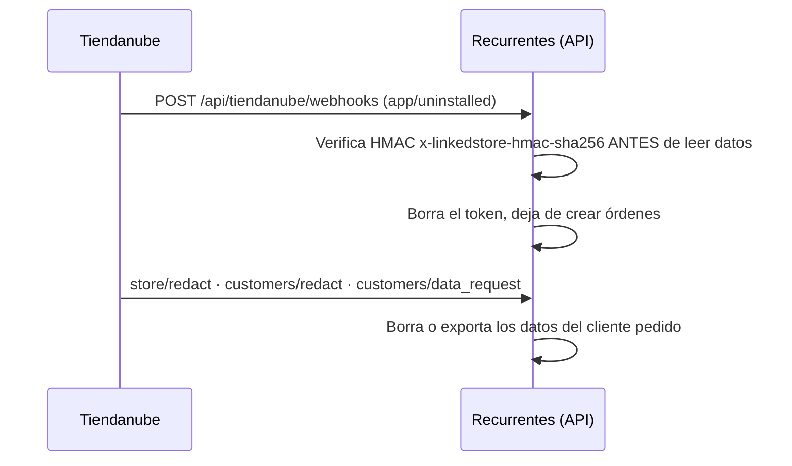

# Homologación Tiendanube — artefactos (app 42443)

Solicitud enviada el 15/09/2026, estado "En aprobación". **Si el equipo pide algo y no
contestamos en 5 días, sacan la app de la cola.** Los cuatro artefactos obligatorios:

| # | Artefacto | Estado |
|---|---|---|
| 1 | Diagrama de secuencia | ✅ acá abajo |
| 2 | Video demo | ⏳ lo graba Thiago (guion acá abajo) |
| 3 | Cuenta demo pre-activada | ⏳ falta crear el usuario (checklist abajo) |
| 4 | NubeSDK | ❌ el widget es un `.js` plano; hay que portarlo |

---

## 1. Diagrama de secuencia

### Instalación y conexión (OAuth)

Si la instalación se hace desde la tienda de aplicaciones sin sesión abierta en Recurrentes,
el callback guarda una instalación pendiente y la cuenta la reclama después con
`POST /api/shopify?action=tn-claim`.

### Creación del plan

### Suscripción del cliente y primer cobro

### Renovaciones y conciliación

### Desinstalación y datos

---

## 2. Guion del video demo

Tiendanube pide ver instalación, registro, login, **reinstalación** y todas las funciones del
diagrama. Sin cortes que salteen pasos. Unos 4 a 6 minutos alcanza.

1. **Instalación** (0:00): entrar a la Tienda de aplicaciones desde la tienda demo, instalar
   Recurrentes, mostrar la pantalla de permisos de Tiendanube y aceptar.
2. **Registro** (0:40): crear la cuenta en Recurrentes con un mail nuevo, mostrar que la tienda
   quedó conectada sola.
3. **Logout y login** (1:10): cerrar sesión, volver a entrar. Mostrar que la tienda sigue ahí.
4. **Conectar Mercado Pago** (1:30): el botón de un clic y el retorno al panel conectado.
5. **Crear el plan** (2:00): elegir un producto del catálogo, poner frecuencia 30 días,
   descuento 15%, guardar. Mostrar el plan creado.
6. **Comprar como cliente** (2:40): abrir la página del producto en la tienda, mostrar el
   selector Compra única / Suscripción, elegir suscripción, completar los datos y autorizar el
   pago en Mercado Pago.
7. **El resultado** (3:40): la orden paga en el panel de Tiendanube, con la nota RECURRENTE; y
   la suscripción activa en el panel de Recurrentes.
8. **Autogestión** (4:20): abrir el portal del cliente y pausar; mostrar el estado en el panel.
9. **Desinstalar y reinstalar** (4:50): desinstalar la app desde Tiendanube, mostrar que
   Recurrentes deja de operar la tienda, y volver a instalarla para que se vea que reconecta
   sin datos duplicados.

---

## 3. Cuenta demo

Hay que entregarles acceso a una cuenta ya activada, sin pasos pendientes:

- URL del panel: https://www.recurrentesapp.com
- Usuario: crear uno con un mail dedicado (por ejemplo `demo@recurrentesapp.com`) y **una
  contraseña que se pueda compartir por escrito** (no reusar una personal).
- Tienda: "DEMO TN" (`m_mu3g91y2qt5tmz`), ya con Tiendanube y Mercado Pago conectados y un plan
  activo sobre PRODUCTO PRUEBA RECURRENTESS.
- Dejar al menos una suscripción activa y un cobro con su orden, así el revisor ve datos y no
  pantallas vacías.
- Tienda Tiendanube de prueba: `recurrentesdemo.mitiendanube.com`. **Tiene contraseña de
  acceso** (tienda de desarrollo): hay que pasarles esa contraseña también.

---

## 4. NubeSDK

Requisito obligatorio desde el 5 de junio de 2026 para toda solicitud nueva. Hoy el widget es
`public/tiendanube-loader.js`: un `.js` plano subido al portal de Scripts que trae
`/widget.js?merchant=…` desde recurrentesapp.com. Funciona para las tiendas conectadas, pero no
cumple el requisito.

Portarlo implica: reescribir el widget de la página de producto como app de NubeSDK, prender el
toggle "Usa NubeSDK" del script 10256 y subir el bundle como versión nueva. Es el único de los
cuatro artefactos que es trabajo de desarrollo y todavía no está empezado.
